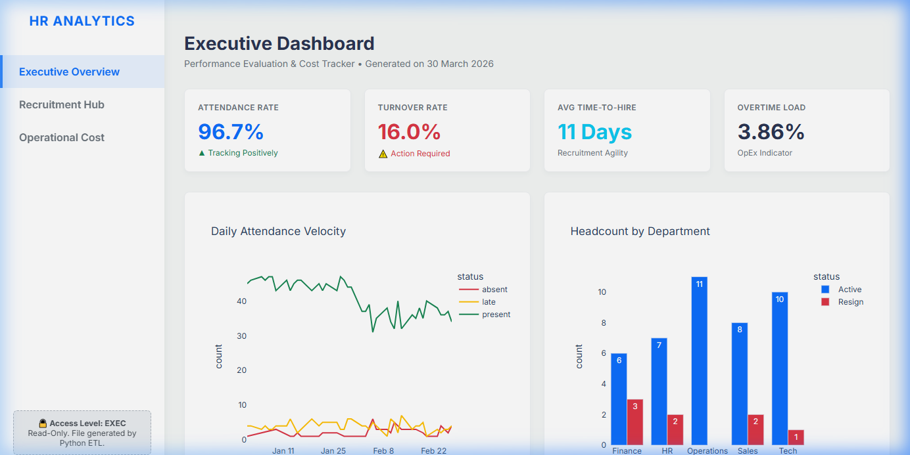
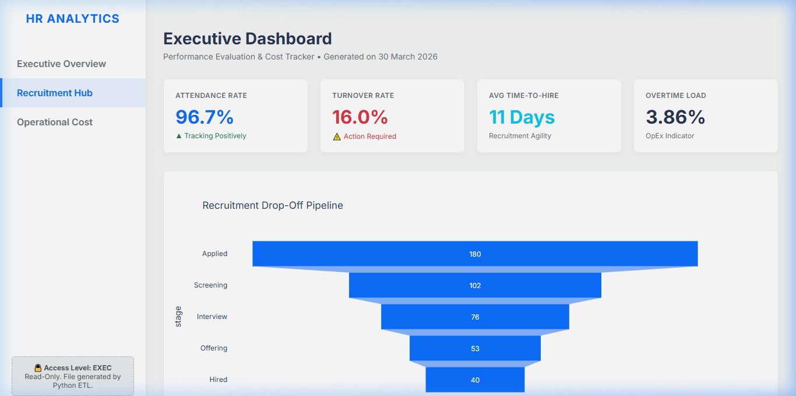
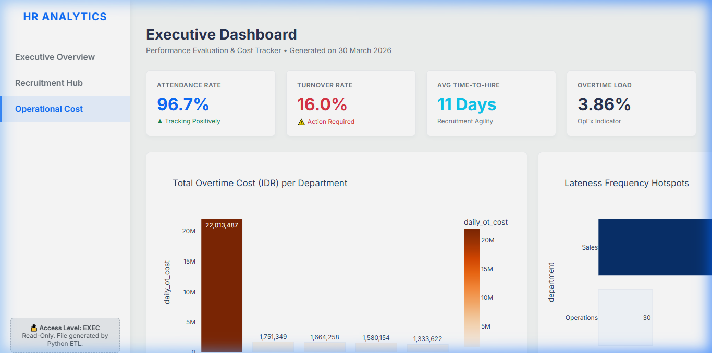

# 📊 HR Analytics & Automation System


[](https://singgihhamdani.github.io/Portofolio-Business-Analyst-HRIS/Executive_Dashboard_RBAC.html)

<br>
<div align="center">
  
  <p><b>▲ Executive Overview</b> — KPI Scorecards, Daily Attendance Velocity & Headcount Distribution</p>
</div>

<div align="center">
  <table>
    <tr>
      <td width="50%"></td>
      <td width="50%"></td>
    </tr>
    <tr>
      <td align="center"><b>▲ Recruitment Hub</b> — Drop-Off Pipeline Funnel</td>
      <td align="center"><b>▲ Operational Cost</b> — Overtime Burn & Lateness Hotspots</td>
    </tr>
  </table>
  <p><i>🔒 Standalone Read-Only HTML Dashboard — Zero Python Dependencies Required</i></p>
</div>
<br>

> **Role:** Business Analyst, Product Manager, Data Analyst  
> **Domain:** Human Resources (HR) Tech  
> **Status:** Completed

## 📖 Project Overview
An end-to-end simulated Human Resources Information System (HRIS) designed to solve the pain points of manual HR data management. This project validates a complete product lifecycle: from drafting a professional **Business Requirement Document (BRD)** and **System Design**, to building a robust **ETL pipeline**, generating **Executive Dashboards**, and deploying a **Google Apps Script** for automated anomaly alerting.

## 🎯 Business Problem & Solution
**The Problem:** Mid-sized companies often struggle with scattered HR records (spreadsheets), leading to delayed reporting, unnotified chronic lateness, untracked recruitment bottlenecks, and bloated overtime costs.  
**The Solution:** A centralized, lightweight Cloud-Native ecosystem treating Google Sheets as a relational database, Python for heavy analytical lifting, and Google Apps Script as an automated watchdog for discipline and recruitment workflows.

---

## 🛠️ Tech Stack & Tools
*   **Documentation & Product Management:** Markdown, Mermaid.js (System Architecture/DFD)
*   **Analytics & Data Wrangling:** Python 3, Pandas, NumPy
*   **Data Visualization:** Plotly Express, Plotly Graph Objects (Interactive HTML Cards)
*   **Automation & Trigger Engine:** JavaScript (Google Apps Script), CRON Jobs, Gmail API
*   **Database:** Google Sheets (Lightweight RDBMS)

---

## ✨ Key Features

### 1. 📈 Standalone Executive HTML Dashboard (RBAC Implementation)
Built a dynamic, Single-Page Application (SPA) dashboard acting as the presentation layer. While the core analytics engine runs on Jupyter Notebooks `(Python, Pandas)`, the ultimate output is compiled into a Read-Only `HTML` file for C-Level Directors. This fulfills the Role-Based Access Control (RBAC) constraint, preventing raw data tampering (*Zero Source-Code Access*).
*   **KPI Scorecards:** Automated calculation tracking *Attendance Compliance, Turnover Rate, Avg Time-to-Hire,* and *Overtime Burden*.
*   **Tabular Switching:** Vanilla JS tab framework categorizing insights into *Executive Overview, Recruitment Hub,* and *Operational Cost*.
*   **Zero Dependencies:** Fully rendered frontend using Plotly CDN & Inter Font that runs on any browser.

### 2. 🤖 Automated Alerting System (Google Apps Script)
*   **Indiscipline Alert (Late >3x/week):** Aggregates daily tap-in data. Automatically emails Supervisors if an employee breaches the maximum weekly lateness threshold.
*   **Candidate Stagnation Alert:** Calculates date differences (`TODAY() - stage_timestamp`). Triggers an alert directly to HR Admins if top candidates languish in a pipeline stage for > 5 days.

### 3. 📄 Enterprise-Grade Documentation
*   Fully refined **BRD v2.0** comprising Functional Requirements, Business Rules, KPI Formulas, UAT Plans, and Role-Based Access Control (RBAC).
*   Detailed **System Design Document (SDD)** visualizing Data Flow Diagrams (DFD) and ERD definitions.

---

## 📂 Repository Structure

```text
📦 HRIS-Analytics-Automation/
├── 📄 README.md
├── 📄 requirements.txt
│
├── 📁 docs/                        # Business & technical documentation
│   ├── Executive_Dashboard_RBAC.html# ⭐ Read-Only Executive Dashboard UI
│   ├── brd_hris_analytics.md       # Business Requirement Document (BRD v2.0)
│   ├── system_design_hris.md       # System Architecture & Data Flow
│   └── Presentation_Deck_HRIS.md   # Slide-by-slide presentation guide
│
├── 📁 data/                        # Raw & generated datasets (input)
│   ├── employee_master.csv         # 50 employees with realistic names
│   ├── attendance_log.csv          # 2 months daily attendance (~1900 rows)
│   ├── recruitment_pipeline.csv    # 180 candidates across 5 funnel stages
│   └── processed_attendance.csv    # Sample GAS-processed output for alerts
│
├── 📁 output/                      # Generated results (output)
│   ├── alerts_log.csv              # Triggered alert records
│   └── payroll_ready_export.csv    # FR-04: Payroll-ready aggregated export
│
├── 📁 scripts/                     # Core Automation Scripts (GAS)
│   ├── Automations.gs              # Google Apps Script for daily alerts
│   └── generate_data.py            # Mock dataset generator
│
├── 📁 notebooks/                   # Deep-dive analytics kernel
│   └── HR_Analytics_Report.ipynb   # Complete ETL & Analytics Sandbox
│
└── 📁 tools/                       # Build tools & Pipeline
    ├── dashboard_template.html     # HTML Layout Design System
    ├── export_dashboard.py         # Injects Plotly charts into HTML
    └── build_notebook.py           # Notebook automation renderer
```

---

## 🚀 How to Run / Explore

**🌟 1. Instant Executive Experience (No Code)**
*   Double-click `/docs/Executive_Dashboard_RBAC.html` directly from your file explorer. It renders instantly in any modern browser without Python installation (requires light internet connection to fetch Plotly CDN & Google Fonts).

**2. Analytics Dashboard & ETL Engine:**
*   Upload the `.csv` files and `HR_Analytics_Report.ipynb` to Google Colab or open locally via VS Code Jupyter Extension.
*   Hit *Run All* to process the ETL pipeline and render the interactive HTML flexbox cards and Plotly charts.

**3. Alert Automation:**
*   Open a new Google Sheets file and import the CSV schemas.
*   Go to `Extensions` > `Apps Script` and paste the contents of `Automations.gs`.
*   Run the `setupDailyTriggers()` function once to establish the daily 08:30 AM CRON Job.

---

## 💼 Key Business Insights Highlight
*   *Overtime Bleed:* Discovered critical under-staffing in the Tech & Operations department causing a massive spike in monthly overtime payouts. Recommendation: Hire 2+ backend engineers to reduce total HR operational cost.
*   *Funnel Bottleneck:* Detected a severe drop-off rate between `Screening` and `Interview` stages natively mapped by the pipeline analysis, urging the HR team to calibrate their initial Job Posting filters to prevent "Talent Pool Blackholes".