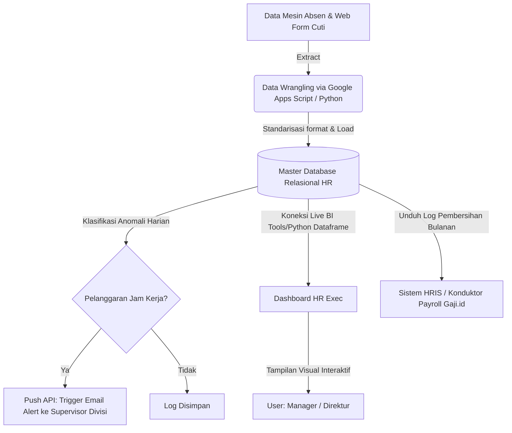

# Business Requirement Document (BRD)
## Proyek: Sistem HR Analytics & Automation

**Versi Dokumen:** 2.0 (Refined Version by Senior Business Analyst & PM)  
**Tanggal:** 28 Maret 2026  
**Status:** In-Review  

---

### 1. Executive Summary
**Ringkasan Proyek:**  
Proyek ini membangun Sistem HR Analytics & Automation untuk mentransformasi manajemen SDM dari metode konvensional (spreadsheet manual) menjadi ekosistem otomatis. Menggunakan *Google Apps Script (GAS)* untuk ETL pipeline data mentah dan *Python* untuk menghasilkan Dashboard Analitik interaktif.

**Masalah Utama:**  
Tim HR menghabiskan >30% waktu operasional untuk tugas administratif berulang: kompilasi presensi manual, pelacakan rekrutmen via WhatsApp yang tidak terstruktur, dan evaluasi kinerja yang bersifat reaktif. Tidak ada sentralisasi data, sehingga manajemen tidak dapat melihat tren *Turnover* atau lonjakan biaya *Overtime* secara real-time.

**Solusi yang Diusulkan:**  
Implementasi *Centralized Data Hub* HR yang mencakup: (1) Sistem notifikasi otomatis untuk keterlambatan karyawan, (2) Modul pelacakan *Funnel* Rekrutmen interaktif, dan (3) Ekspor ringkasan presensi "siap hitung" ke Sistem Payroll pihak ketiga dengan akurasi 100%.

---

### 2. Background & Problem Statement
**Kondisi Saat Ini (AS-IS):**  
Saat ini, fail rekam jejak departemen SDM tak saling terkait (*Siloed*); data mentah absensi berbentuk CSV murni, evaluasi presensi disalin bulan-ke-bulan oleh operator, dan antrean pelamar mandek dalam daftar tunggakan pesan.

**Pain Points Utama:**
- **SLA Ekstraksi Laporan Kritis:** Pembuatan *Headcount* dan Kalkulasi Cuti/Lembur menahan HR Admin selama 3-4 hari kerja berturut-turut pada akhir tutup buku bulanan.
- **Lost Candidates / Pipeline Buta:** Kegelapan matriks fasa transisi interviu menumbulkan gesekan hingga hilangnya 15-20% *Talent* kaliber prima (Kandidat mundur karena jeda birokrasi panggilan tak efisien).
- **Keputusan Reaktif:** Keputusan *retention program* dan promosi dilakukan tanpa dasar fondasi historis.

**Dampak Bisnis (Business Impact):**
Biaya upah jam tambahan seringkali tak tergambar akurat dengan luaran pendapatan (OpEx membludak). *Time-to-Hire* yang statis menyakiti momentum ekspansi kuartal berjalan akibat kursi spesialisasi divisi tak berawak dengan cukup cepat.

---

### 3. Objectives
**Tujuan Makro Bisnis (ROI Goals):**
- Memangkas waktu kompilasi laporan HR sebesar **85%** (dari ~24 jam/bulan menjadi <4 jam/bulan).
- Mempercepat siklus rekrutmen (*Time-to-Hire*) melalui deteksi bottleneck otomatis.

**Tujuan Mikro Fungsional Sistem:**
- Menyatukan seluruh data HR ke dalam *Single Source of Truth*.
- Mengaktifkan *email alert* otomatis untuk pelanggaran kedisiplinan karyawan.
- Membangun *Executive Dashboard* interaktif sebagai pusat pengambilan keputusan.

---

### 4. Scope
**In Scope (Batasan Lingkup Internal):**
- Dasbor analitik dengan *tabulation* menu: *Attendance Monitor*, *Recruitment Pipeline*, & *Employee Overview*.
- Infrastruktur ETL dasar harian (*Extract, Transform, Load*) guna penjadwalan pembersihan sampah *sheet*.
- Gerbang integrasi format API / JSON bagi sinkronisasi pasokan data rekap ke Sistem Komputasi Payroll (Gaji.id / Pihak Ke-3 Eksternal).

**Out of Scope (Di Luar Lingkup Fase Ini):**
- Modul *Core Payroll engine* yang menghitung logika akuntansi potongan progresif PPh21, maupun pembagian nominal BPJS Kesehtan langsung secara internal.
- Formasi produk Mandiri di App Store (Aplikasi Ponsel *Employee Self Service* ESS Native Android/iOS).
- Rekayasa konektor otomasi pasang lowongan (*posting*) langsung ke web *Job Portal* semacam Jobstreet.

---

### 4.1 Feature Prioritization (MVP vs Phase 2)
Melalui lensa *Agile Product Management*, pengembangan sistem dipecah menjadi beberapa fase untuk memastikan tercapainya *Return on Investment* (ROI) atau penghematan operasi HR sedini mungkin (*Quick Wins*).

**Fase 1: Minimum Viable Product (MVP) - *Core Operation***
Fitur berstatus *Mandatory* untuk operasional pondasi rilis terawal (*Go-Live*):
1. **Automasi Ingesti Absensi (Data Cleaning):** *Alasan Bisnis:* Modul inilah pencuri jam produktif terbesar akibat pengerjaan manual mingguan dari tim HRD.
2. **Ekspor File Induk Siap-Payroll:** *Alasan Bisnis:* Meminimalkan *human error* di waktu gajian sekaligus mengukur persentase selisih hitung dari versi presensi manual lama.
3. **Dashboard Matriks Kehadiran Dasar:** *Alasan Bisnis:* Media penyajian hasil bagi mata direksi atas operasional MVP.

**Fase 2: Skalabilitas Layanan & Peringatan (*Scale & Automation alert*)**
Fitur berkelanjutan sesudah pondasi dirasa *reliable*.
1. **Peringatan / Email Surel Anomali Otomatis:** *Alasan Bisnis:* Diletakkan di fase tengah demi berjaga-jaga membongkar malfungsi perhitungan sistem pelabelan tanpa kepanikan mengirimkan surel palsu ke direksi.
2. **Advanced Recruitment Pipeline:** *Alasan Bisnis:* *Tracking* historis kandidat membutuhkan penumpukan bank daya masukan dari lapangan terlebih dahulu agar terbentuk grafik wawasan (*historic training*) corong seleksi.

---

### 5. Stakeholders
| Nomenklatur Jabatan | Posisi Keterlibatan Proyek | Ekspektasi Bisnis / Kebutuhan Esensial |
| :--- | :--- | :--- |
| **HR Manager** | *Project Sponsor* & *Key Evaluator* | Kejelasan metrik level helikopter ihwal fluktuasi *Turnover* dan waktu rerata komitmen rekrutmen *(Time-to-Hire)*. |
| **HR Admin / Recruiter**| *End-User (Operator Input)* | Antarmuka interaksi minim rumus rumit untuk mengawasi status gerak calon pelamar maupun jam kerja. |
| **C-Level / Direktur** | *Decision Maker (Viewer)* | Rekapan konklusif soal grafik kebocoran kas vs profitabilitas berdasar kompensasi lembur antar-departemen. |
| **IT/Business Analyst** | *Implementor & Maintenance* | Dokumentasi kode terang, keluwesan modifikasi modul ke depan, batasan ketersediaan dana server. |

---

### 6. Business Process
**AS-IS Process (Skema Konvensional Lama):**
1. Tarikan manual USB Mesin Sidik Jari / Ekspor `.csv` via mesin tiap tutup bulan buku oleh eksekutif operasional SDM.
2. Pelaksanaan manipulasi kolom berulang semacam *VLOOKUP* pencocokan Departemen Excel ke ID Log kedatangan staf.
3. Pemantauan gerak pelamar manual (*Recruitment tracking*) dikerjakan menggunakan pewarnaan palet sel tabel yang berantakan dengan *follow up* via *WhatsApp* manual.
4. Pembuatan presentasi *Dashboard Chart/Pivot* direka perlahan sebelum dipasang ke format edaran cetak internal manajemen.

**TO-BE Process (Setelah Sistem) - Visualisasi Arsitektur Alur:**

---

### 7. Functional Requirements (FR) Enhancement
Spesifikasi Fungsional di bawah ini diolah dengan metode terarah (Spesifik, Terukur, & Bertindak pada aturan Logika) agar siap dieksekusi secara presisi oleh pengembang *(Developer).*

**FR-01: Automasi Ingesti (*Ingestion*) Log Absensi Harian**
- **Trigger:** Dieksekusi otomatis oleh *Job Scheduler* tiap pukul 23:59.
- **Logic:** *Script* akan mencomot kumpulan unduhan log biometrik hari itu. Melakukan algoritme *Deduplication* atas kejadian karyawan menekan *tap* absen > 1 kali berderet karena error mesin, serta menangkap pencocokannya dengan ID Karyawan tabel struktur perusahaan terpusat.
- **Output:** *Database Table* absen yang sepenuhnya bersih tanpa anomali duplikat kotor maupun penanda entitas gaib (*Ghost Employee ID*).

**FR-02: Pemindaian Corong Tahapan Perekrutan (Funnel Tracking)**
- **Trigger:** Perpindahan status baris kandidat pelamar pada *Google Sheets / Database* lokal oleh staf Recruiter.
- **Logic:** Fitur memformulasikan stempel waktu (*timestamp flag*) detik perpindahan rekrusi kandidat dari status "Sourcing" ke tahap berikutnya (cth: "Wawancara User"). Apabila formula menemui kalkulasi durasi tertahan >= 5 hari sejak *timestamp* terakhir, beri markah status indikator "Stagnated/At Risk".
- **Output:** Label berwarna visual "Tertahan" (*Warning Red Alert*) terpantau menyala di antarmuka UI Rekrutmen Dashboard bagi masing-masing nama dan departemen pelamar.

**FR-03: Eskalasi Dini Peringatan Keteledoran Absensi**
- **Trigger:** Skrip pemantauan otomatis (CRON Job pada pukul 08:30 Pagi).
- **Logic:** Melakukan penilaian terhadap absen yang secara agregat memuat kategori kolom *"LATE/Telat"* murni >15 Menit berulang atau sel data masuk nihil (kategori ALFA - absen membolos hampa tanpa tag izin) yang mana melampaui batasan plafon >= 3 Hari kerja pada sepekan putaran tersebut. 
- **Output:** Modul transmisi Pengiriman subjek surel otomatis (*Auto Email Notifier*) terkirim kepada pimpinan/supervisor teknis karyawan terindikasi beserta catatan ID historis harian. 

**FR-04: Ekspor Kompilasi Bersih Siap Hitung Payroll**
- **Trigger:** *On-Demand User Input* (HR menekan ikon Unduh/Export to Payroll).
- **Logic:** Melakukan validasi *Query Aggregate* sekuens rentang periode gaji berjalan (Tanggal 26 - Tanggal 25). Sistem wajib mengakumulasi total durasi murni Lembur tervalidasi setelah dikurangi batas toleransi maupun meninjau pemotongan gaji telat parsial dari karyawan. Menata seluruh struktur baris tajuk (*Header*) sesuai dengan parameter konverter impor sistem pemroses Gaji.
- **Output:** Melahirkan ekstensi berkas mentah `.CSV` tunggal bernilai absolut tanpa anomali rumuskan.

---

### 7.1 Business Rules (Aturan Bisnis Internal Perusahaan)
Bentuk panduan kebijakan yang menunggangi implementasi pemrograman kode (*Developer Constraints*):
- **BR-01 (Toleransi Dispensasi Kehadiran):** Memegang *Grace Period* kehadiran pukul 08:15 (Toleransi keterlambatan baku maksimal 15 Menit). Setelah melewati limit presisi waktu sedetik saja, harus ditempel stempel kolom `"Late"`. 
- **BR-02 (Pembuktian Lembur Valid):** Total akumulasi Jam Lanjut Operasional *Overtime* harian berstatus wajib tidak dieksekusi hitung kompensasi jika rekaman basis tak menyimpan bukti stempel digital persetujuan (*approval flag*) Direktur Area pada H-1.
- **BR-03 (Talent Pijakan Rekrutmen):** Kandidat tes usai wawancara tak lolos tidak diizinkan tertimpa penghapusan paksa oleh pengolah basis data (*Strictly No Hard-Delete Code*). Rekaman dilabeli kategori retensi arsip beku guna basis wawasan *Sourcing Pool* dua tahun muka.

---

### 8. Non-Functional Requirements
- **Performance:** Eksekusi beban *script backend wrangling data* harian untuk 1.000+ pergerakan arus presensi sel target durasi siklus maksimal di angka mutlak <2 Menit. Rendering grafik visual dasbor *frontend* maksimum jeda respons pembukaan UI <3 Detik dalam jaringan standar. 
- **Usability:** Implementasi skema warna penentu (Indikasi Pewarnaan Hierarki); Hijau muda *(Good Standing Condition)*, Kuning *(Warning Label)* untuk kandidat tersendat, Merah Terjal *(Danger Excursion)* untuk pengerucutan matrik *turnover* fatal.
- **Reliability:** Perangkat harus mampu ter-koneksi pembaruan skema tanpa butuh paksaan *triggering button* manual (*Asynchronous load* periodik berdasar interval jam).
- **Maintainability:** Komponen log transkrip sistem dapat direkam per kegiatan dengan gampang dikalibrasi jika susunan nama format departemen direstrukturisasi/dilebur divisi lain.

---

### 8.1 Role-Based Access Control (RBAC)
Manajemen matriks keamanan hirarki sistem, ditegakkan agar mencegah sentuhan yang tidak pada kapabilitas hak informasi sensitif perusahaan (*Principle of Least Privilege*).

| Peran (Role) | Tingkat Akses | Hak Baca (View Policy) | Hak Edit (Edit Privilege) | Aksi Operasional (Action/Export) |
| :--- | :--- | :--- | :--- | :--- |
| **HR Admin** / Operator | Dasar (L-1) | Bisa melihat dasbor taktis *Recruitment Funnel* detil & Dasbor Pergerakan Harian. Tidak diberi lihat rincian gaji final (Pajak). | **Tingkat Tinggi (Yes).** Bebas melakukan tindakan revisi penyelewengan (*Manual Override*) bilamana log mesin absen alami deviasi *bug/offline*. | **Tingkat Tinggi (Yes).** Mengunduh penuh hasil cetakan *CSV payroll raw data* untuk dikirim. |
| **HR Manager** | Menengah (L-2) | Dapat mengoperasikan Filter parameter level sub-Divisi. Turut menajamkan wawasan pola sentimen karyawan & Peta resiliensi Retensi. | **Level Otorisasi Approval**. Khusus merubah status persetujuan dokumen Cuti & Peningkatan Lembur massal. | **Terbatas (Limited).** Mencetak bahan presentasi visual dasbor analitis ke rapat eksternal mingguan (.PDF / Grafis). |
| **Director / C-Level** | Eksekutif (L-3) | Hak visibilitas menyeluruh sebatas konklusif *Big Picture* Overview (cth: ROI Lembar Absensi vs Performa Penurunan Laba per Divisi). | **Mutlak Tertutup (No).** Operasi dirancang semata-mata Read-Only menghindari ketidaksengajaan terhapus. | Akses ke dasbor cetak statis presentase bulanan. Tidak mendapat tombol pelacakan PII Mentah bawah (*Personally Identifiable Information*). |

---

### 9. Use Case & Functional Specifications (Acceptance Criteria)

- **US-01: Ingesti Data Keringat via Automasi**
  - *As an* **HR Admin**, *I want to* terbebas dari siksaan rekapitulasi data telat masuk via sinkronisasi mulus, *so that* saya dapat mendorong muat data kompilasi lembur siap pakai ke aplikasi konduktor penggajian (Payroll engine).
  - **Acceptance Criteria (AC):** Skrip secara pintar terbukiti mensortir tumpang tindih klik rekaman (CTH: 2 kali entri absen pada 07.59). Keluaran final berbentuk *Data Extracted CSV/JSON* dapat dicerna lurus oleh Pihak ke-3 Payroll API Format.

- **US-02: Dasbor Visibilitas Retur Karyawan (Turnover Metric)**
  - *As an* **HR Manager**, *I want to* melongok sajian rupa ringkasan riwayat gelombang mundurnya relasi staf perusahaan bulanan di platform analitik, *so that* saya sigap mendesain kebijakan intervensi pengikat loyalitas divisi dominan resignasi.
  - **Acceptance Criteria (AC):** Keberadaan filter *Slicer Panel Dropdown* pembatas periode (Bulan Tertentu / Kuartal / YTD) yang otomatis menghidupkan grafik representasi Bar Chart.

- **US-03: Teguran Sistemik Dini Otomatis (Alert)**
  - *As a* **Divisional Supervisor**, *I want to* disurati peringatan deteksi dini surel elektronik menyangkut penyimpangan absen kolega pelaporan di seksi saya, *so that* tindakan penegakkan verbal terlaksana segera secara prediktif. 
  - **Acceptance Criteria (AC):** Konfigurasi peringatan wajib tersentak beroperasi membunyikan Surel tatkala seorang nomor induk kealpaan nihil absennya melonjak menembus 3 Insiden per kurun 7-Hari berurutan.

---

### 10. Data Requirements
**Struktur Atribut Inti Relasi Kolom:**
1. **Employee Profile (Dim):** `employee_id` (PK), `name`, `department`, `job_title`, `join_date`, `status` (Active/Resign).
2. **Attendance Journal (Fact):** `date`, `employee_id` (FK), `check_in`, `check_out`, `status` (present/late/absent), `overtime_minutes`.
3. **Pipeline Applicant:** `candidate_id`, `position`, `department`, `stage` (Applied/Screening/Interview/Offering/Hired), `stage_timestamp`, `status` (Active/Passed/Rejected/Hired).

---

### 10.1 Data Flow Detail (Arsitektur Ekstrak Pemrosesan ETL Per Modul)
Berikut mekanisme lintasan Pipa Siklus Transformasi Matriks (ETL Line):

**A. Modul Kehadiran & Lembur (Attendance Flow)**
- **Input Data**: Himpunan tarikan Log teks mesin terminal ketik (*Fingerprint dump*) bercampur respon Formulir Pengecualian (*Google Forms*) cuti sakit (cth:`10023, 11-10-2026, 07:56:00`).
- **Process**:
  - *Data Cleaning*: Melempar eksistensi baris telat (*Null Values*), lalu melancarkan harmonisasi skema jam dunia berdasar rujukan wilayah (WIB - Datetime `YYYY-MM-DD HH:MM:SS`).
  - *Transformation*: Subtraksi matematis nilai presensi aktual. `[Jam Selesai Kantor Maksimal - Jam Pemenuhan Rekam Pulang]`. Pemberian denda label Late memicu manakala Timestamp Tap Masuk mencetak pendaratan > 08:15:00.
  - *Classification*: Pembagian segudang klasifikasi nilai akhir (Standar Normatif / Lebihan Menit Klaim / Telat Fatal / Karyawan Cuti Libur).
  - *Aggregation*: Penghitungan pengelompokan (GROUP_BY ID dan Nama Parameter Bulan) guna ditelan *Fact Table*.
- **Output Data**: Master Table terhidrasi yang siap diperas jadi sumber sajian presentasi visual Dasbor serta Modul CSV Impor Rekayasa Gaji (Payroll).

**B. Modul Pemantauan Talenta Pelamar Kerja (Recruitment Pipeline)**
- **Input Data**: Tarikan Webhook form pelamar (*Applicant Tracker JSON*) berbarengan input lembar evaluasi HR.
- **Process**:
  - *Data Cleaning*: Validasi dan identifikasi kolom surat elektronik (Email/Telepon) sebagai kunci gembok terunik (pencegahan duplikasi orang yang mendaftar peran berganda serempak).
  - *Transformation*: Implementasi rekam *Delta Time Timestamp* antar babak persinggahan kandidat (*Sourcing to First Interview -> Lateness count*).
  - *Aggregation*: Melangsungkan Agregasi tingkat transisi (*Conversion Phase Percentage Rate*). Akuntansi rata-rata siklus (*Date hired - Date Input*) seluruh pelamar per departemen rekrutsi.
- **Output Data**: Penopang matriks corong laju corong rekrutasi. Pemicu flag kandidat tertunggak di UI.

---

### 11. Reporting & Dashboard (Penyajian Evaluasi Antarmuka Laporan)
Demi pemastian presisi angka dari program yang kelak tertuang menjadi komponen analitik bahasa Python interaktif pada dasbor BI utama, algoritma pelaporan mutlak diikat per definisi persamaan (KPI Formula):

**Definisi Formula Otomatisasi Matriks (KPI Matematis)**
1. **Attendance Rate %** 
    - `Rumus: (Total Seluruh Hari Kehadiran Aktual Divisi X) ÷ (Total Jumlah Headcount Karyawan Divisi X × Jumlah Hari Masuk Normal Periode Tsb) × 100`
    - *Konteks Bisnis:* Lensa ukur barometer kesadaran, kelelahan (*burnout*/sakit), dan rutinitas penyesuaian lapangan kinerja.
2. **Time-to-Hire** 
    - `Rumus: Aggregate Mean (Rata-rata) / [(Kalender Tanggal Pengikatan Kontrak Kesepakatan Lisan/Tertulis) - (Angka Tanggal Pemasukan Formulir Kandidat Terserap ke Sistem)]`
    - *Konteks Bisnis:* Navigasi patokan efisiensi sekelompok regu Talenta Perekrut dalam menyegel kursi kosong bernilai tinggi lekas disikapi tanpa panjang birokrasi buntu.
3. **Turnover Rate (Resignation Ratio) %** 
    - `Rumus: [Σ Total Personil yang Mengundurkan Diri Sepenuhnya pada Kuartal Hitung Saat Ini] ÷ [(Angka Estimasi Populasi Karyawan Aktif Memulai Kuartal + Populasi Menuju Akhir Kuartal)/2] × 100`
    - *Konteks Bisnis:* Evaluasi kegagalan pemeliharaan ekosistem tempat kerja ideal yang mendongkrak budaya loyalitas departemen (*Red Alert Status*).
4. **Overtime Cost Exposure Value %** 
    - `Rumus: (Keseluruhan Angka Kumulatif Beban Lembur Operasional Diakui di Divisi) ÷ (Σ Angka Target Kerja Reguler Minimum yang Tercantum Kontrak dalam Kompensasi Divisi) × 100`
    - *Konteks Bisnis:* Memberikan senter penunjuk jika tim tengah digerus beban proyek di luar batas toleransi efisiensi, sebagai cermin inisiatif menambah regu baru alih-alih melebarkan margin penalti kompensasi.

**Visualisasi Interaktif Utama:**
- *Time Series Line Chart*: Pemantauan ritme turun/naik ketidakhadiran rentang bulan berjalan.
- *Pipeline Flow/Funnel Diagram*: Corong visual volume rekrutmen tiap tahap (menggembung ke meruncing).
- *Stacked Segment Bar Chart*: Distribusi *headcount* tiap sub-divisi vertikal. 
- *Grid Heatmap Matrix*: Peta pekat densitas warna menyala yang mendeteksi hari/minggu tertentu intensitas keterlambatan menumpuk paling drastis (*Red Zone Mapping*).

---

### 12. Assumptions & Constraints
- **Asumsi Infrastruktur:** Keseluruhan personel SDM sentral (*Key Stakeholders*) sudah diakomodasi ke lisensi tunggal arsitektur basis Google Workspace untuk integrasi skema *Auto-Google Sheets Scripting* nan lancar. Aturan penyebutan NIK (*Nomor Induk / Employee No*) berseragam tanpa kekeliruan varian digit ganda dari mesin lama ke baru.
- **Keterbatasan Ekosistem Daya Penuh:** Rencana berpondasi operasional *Lightweight/Open Source Analytics Engine*. Mengisyaratkan pertimbangan taktik limit eksekusi durasi *Runtime* dari lingkungan Google *(max 6 minutes CPU limit)* dan hambatan pengolahan (*Rate Limiting APIs Requests*).

---

### 12.1 Project Risks & Mitigation Strategy (Penilaian Evaluasi Bahaya)
1. **Risiko Data Mentok (Ceiling Volume Error)**
   - **Risk:** Menangani tabrakan dinding maksimun volume perbatasan sel Google Sheets (Limit >10 Juta Sel) seiring masa historis karyawan masif tahunan yang terus numpuk.
   - **Mitigation:** Inisialisasi *Script Auto-Archiving* paruh waktu rutin menyikat sel historis basi tiap *New Year Eve* (31 Desember). Memisahkan berkas rekam usang dipotong berlembar menjadi arsip (*Cold Storage*) yang dibaca instrumen Python.
2. **Risiko Lumpuh Koneksi Terminal Log Harian (API Outages)**
   - **Risk:** Menjumpai pemadaman sambungan nirkabel pemancar absen Biometrik menyetok berkas rekap *Cloud* per hari Jumat. 
   - **Mitigation:** Meletakan pelampung penyelamat (Fail-safe Dropdown Mode) dengan menginjeksikan area pengunggah *.CSV* terproteksi bagi pengerjaan Admin internal apabila arus internet menawan data absen murni agar alur tidak jebol/mogok baca sistem konverter di tengah malam.

---

### 13. User Acceptance Testing (UAT) Plan - Fase Tes Mutu Pengguna
Penyegelan kelulusan arsitektur sistem mesti dicekal persetujuan fungsionalitas (*Key User Verification*) lewat Skenario di bawah ini yang digawangi para Eksekutif Divisi:
1. **Skenario Cleansing Transaksi Ekspor Payroll:** Naracoba Operator Admin meletakan isian sel palsu ganda maupun celah bolong tanpa persetujuan izin (S/C). **Expected True Result:** Susunan *Logic Backend* sukses melenyapkan kebingungan rekaman klik. Lalu melahirkan keluaran *Comma Separated Values* akurat hingga 2 angka desimal sesuai kalibrator format impor eksternal (*Passed for Payroll engine load*).
2. **Skenario Transmisi Pembaca Notifikasi Stagnansi:** Mendorong data profil tes pada antrean proses "Tunggu Inteviu Pengguna Kedua" selama interval 6 Hari kerja mutlak diam (*No Update Trigger*). **Expected True Result:** Mesin pendeteksi (*Cron Job Engine*) rewel mendeteksi stempel statis & Kepala Regu Manajer Rekrusi menerjang inbox kotak *Outlook/Gmail* melontarkan subjek intervensi "Candidate at Risk" instan (*Success Flag*).
3. **Skenario Perimeter Ruang Autentikasi Rahasia Dasbor:** Seseorang asing menyalin *URL Hyperlink Dashboard* untuk melangkah masuk bermodal identitas tak tervalidasi perusahaan publik ganda luar angkasa (Gmail Bebas). **Expected True Result:** Tembok pembatas (*Access Gateway Guard*) merespon penolakan langsung (Unauthorized) dalam pendaratan tampilan hampa (*Passed Privilege Test*).

---

### 14. Success Metrics (KPI Kesuksesan Rilis Akhir)
Sistem simulasi transformasi HR ini ditahbiskan mencapai batas paripurna usai transisi peluncuran rilis berpegangan pada tiang pengukur:
1. **Efektivitas Waktu Operasi Tangkas:** Pemampatan pengikisan deret jam berulang *(Admin Fatigue)* saat mengekstrak kompilasi lembaran hitung gaji akhir dipangkas sukses memutar waktu minimal ambang penghematan 80%-85%.
2. **Tingkat Toleransi Kedefektifan Nihil (Zero-Error Defect):** Rentetan total matriks integrasi tabel kehadiran yang bermuara menjadi sel masukan piranti Modul Komputasi Gaji terdeteksi **Presisi 100% konsisten** selaras realita log jam tanpa deviasi gesekan numerik murni manusia (*human manual oversight*).
3. **Metrik Kesan Umpan Balik (User Feedback SAT):** Menyabet predikat penilaian rubrik uji kesenangan perihal manuver kecepatan navigasi grafik Dasbor UI dengan rasio minimal bernapas > 9 (skala 1-10) saat tahap pelatihan konversi rilis.

---

### 15. Future Enhancements (Protokol Rencana Skalabilitas Tahap Panjang)
Inisiatif modernisasi keberlanjutan arsitektur pengembangan SDM korporasi esok apabila pilar pengukuhan telah adaptif tertancap mantap:
- **Pelacakan Algoritme Prediktif Churn rate Resignasi (Machine Learning):** Peleburan model algoritma hutan pohon probabilitas statistika regresi prediktif Python ke set data (gaji rendah/ketahanan mutasi wilayah terpencil). Memberikan kartu merah antisipasi kepada Manajemen Eksekusi ketika perilaku sinyal penularan stres karyawan menajam dan terdeteksi ingin melakukan penyuratan aksi letak jabatan (*Likely of Resigning Soon*).
- **Sentiment Analysis Text Processing (NLP Data):** Mempekerjakan program kecerdasan *Natural Language Toolkit/AI* di ranah pelacakan formulir survei catatan wawancara undur diri ("Alasan Evaluasi Pindah"). Mensensor kumpulan baris kata untuk menentukan nilai awan frasa tabu moral seperti *"Gaji Rendah, Mikro Manajer, Burnout Berlebih, Beban Pekerjaan Tim Ganda"* pada level perdepartemen demi pencegahan retensi sistemik membengkak krisis.*
